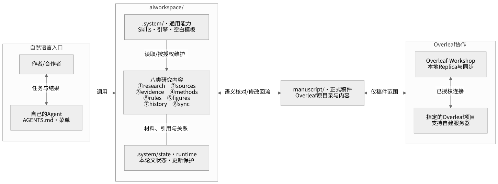
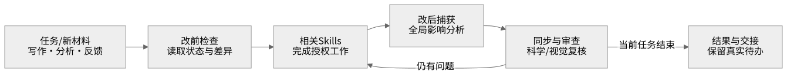
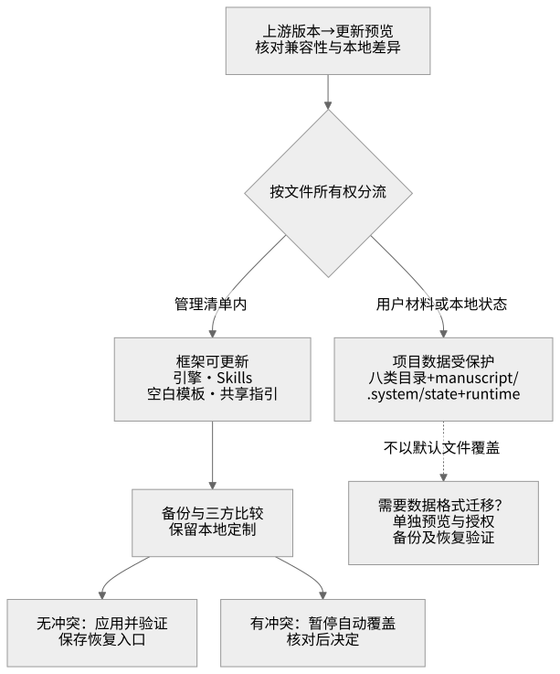

# AI Research Workspace

**用自然语言推进论文，在一个工作区里保留研究逻辑、证据、方法与每次修改的来由。**

面向论文作者与合作者的本地 AI 科研工作区。通过自己的 Agent 完成研究规划、文献阅读、数据分析、写作、绘图和审查，让研究上下文随论文持续积累。用户描述任务，Agent 在授权范围内处理工具、目录与记录。

[整体架构](#architecture) · [目录与职责](#layout) · [八类研究状态](#research-areas) · [开始使用](#quickstart) · [不同使用起点](#workflows) · [维护与开发](#maintenance)

## 背景与目标

论文的工作横跨文献、想法、数据、方法、正文和反馈。只保存最终文字，很难追踪“这个论点依据什么”“为什么换了方法”“一句改动影响哪些章节”。

AI Research Workspace 将研究材料、论证关系、方法运行、图表来源和修改历史一起维护。写作、绘图与审查围绕同一个项目展开；科学判断、账号授权和最终投稿责任由实际责任人承担。

<a id="architecture"></a>
## 整体架构

**唯一的 `aiworkspace/` 保存八类研究状态；与它并列的 `manuscript/` 保存正式稿件。** Agent 是自然语言入口，Skills 负责科研过程，Overleaf-Workshop 负责稿件文件与远端协作。

> **实现状态：** 下图展示已确定的单工作区目标架构。当前 `0.6.1` 引擎仍使用旧的 `workspace/` 路径；源码路径迁移尚未完成。本次更新发布说明与图文件，不移动论文或重建状态。旧项目应保持原位，详见文末[兼容状态](#compatibility)。



[放大总架构图](aiworkspace/docs/architecture/architecture.svg) · [可编辑 Mermaid 源码](aiworkspace/docs/architecture/architecture.mmd)

**两种同步各有职责。** Manuscript Sync 核对研究含义与稿件表达；Overleaf-Workshop 同步本地稿件文件与指定远端。文件同步后，仍需检查相关论点、证据、数字和结论。

<a id="layout"></a>
## 目录与职责

单工作区迁移完成后，按以下结构组织。当前目录明确时默认在这里工作；出现多个论文、候选稿件或覆盖冲突时才询问，不要求用户重复选择存放位置。

```text
project-root/
├── AGENTS.md                      # Agent 启动、菜单和任务分流
├── CLAUDE.md                      # Claude Code 入口，复用统一指引
├── README.md                      # 整个项目的说明
├── update_aiworkspace.py           # 增量更新入口，由 Agent 操作
│
├── aiworkspace/                    # 唯一科研工作区
│   ├── README.md                  # 当前论文的八类内容导航
│   ├── research/                  # ① 研究问题、假设、贡献与论证
│   ├── sources/                   # ② 文献、检索与来源材料
│   ├── evidence/                  # ③ 本文证据及 Claim 对应
│   ├── methods/                   # ④ 方法、数据、代码与结果
│   │   ├── data/
│   │   ├── code/
│   │   └── results/
│   ├── rules/                     # ⑤ 导师、期刊、AI、引用与文风
│   ├── figures/                   # ⑥ 图表规划、图源与生成过程
│   ├── history/                   # ⑦ 讨论、决策、评审与修改历史
│   ├── sync/                      # ⑧ 同步、冲突与待复核事项
│   └── .system/                   # 内部配套，用户无需直接操作
│       ├── engine/                # 通用工具：框架可更新
│       ├── skills/                # 科研 Skills：保留本地定制
│       ├── templates/             # 空白模板：框架可更新
│       ├── state/                 # 本论文状态：更新保护
│       └── runtime/               # 本地运行与恢复材料：更新保护
│
├── manuscript/                    # 直接对应 Overleaf 的稿件根目录
│   ├── main.tex                   # 以下名称均为示例，沿用原稿
│   ├── sections/
│   ├── figures/
│   └── references.bib
│
├── .agents/                       # Codex 等宿主的公开 Skill 入口
├── .claude/                       # 共享 Claude 指引
└── .github/workflows/              # 开发者的自动测试配置
```

**根 README 解释整个项目，`aiworkspace/README.md` 引导当前论文的工作。** `.system/` 是内部配套，不构成另一个工作区。它的通用引擎与本论文状态虽然位于同一目录下，更新权限仍需分别管理。

`manuscript/` 沿用原稿的文件名、章节、图像、参考文献和相对路径。原样导入协议要求不插入追踪标记、不合并章节、不用空 Markdown 替代已有论文；后续授权编辑直接修改这份工作副本。插件维护的 `.overleaf/` 是本地连接元数据，不属于投稿内容。该导入协议与当前旧引擎的差异见兼容表。

<a id="research-areas"></a>
## 八类研究状态：补什么、放哪里

下面是统一架构的填写入口，路径相对 `aiworkspace/`。实际文件由兼容的初始化／迁移流程准备；旧项目不要仅按表手动搬目录。

| 状态 | 作者补充入口 | 内容与长期维护职责 |
|---|---|---|
| **① Research & Logic** | `research/research-brief.md`、`research/idea-evaluation.md`、`research/argument-map.md` | 问题、假设、核心贡献、整篇论证、章节职责、Claim 和逻辑缺口 |
| **② Sources & Literature** | `sources/reading-notes.md`，配套文献与搜索记录 | 检索范围、关键词、比较对象、阅读判断、来源等级与文献关系 |
| **③ Evidence** | `evidence/evidence-notes.md`，配套证据矩阵 | 原文位置、数据／实验结果、适用条件、支持／反驳／限定关系和核验状态 |
| **④ Method & Analysis** | `methods/method-plan.md`；`methods/data/`、`methods/code/`、`methods/results/` | 研究设计、数据来源、样本单位、模型、参数、运行和可复现结果 |
| **⑤ Rules** | `rules/project-policy.md`，配套期刊规范和术语表 | 导师、学校、期刊、伦理、AI、隐私、引用、文风；记录来源、适用范围和版本 |
| **⑥ Figures & Tables** | `figures/figure-plan.md`，配套图表子目录 | 每张图表的目的、数据、论点、编码、设计理由、图源、工具、图注与版本 |
| **⑦ Decisions & History** | `history/decisions.md`，配套讨论和评审记录 | 备选方案、AI 意见、作者／导师选择、理由、谁做了什么、是否执行及遗留问题 |
| **⑧ Sync State** | `sync/handoff.md`；其他状态由系统维护 | 交接、暂不修改的范围、未同步差异、双向冲突、全局影响及待复核事项 |

**直接补充 Markdown，或把材料告诉 Agent，由它归位。** 无需先填满八类。新研究先明确问题、已有材料和规则；已有论文先读原稿，再确认真正缺少的信息。程序状态、哈希和内部编号由工具维护，用户无需编辑 JSON。

材料之间通过引用关联：Sources 保存参考材料，Evidence 用于检验具体 Claim；Methods 保存实际数据与结果，Evidence 引用其位置，避免重复维护副本。图表源材料归 `figures/`，正式成品进入稿件原有图目录，并保留版本对应。

Decisions & History 提供上下文，AI 建议、偏好和未定方案不能自动成为硬性事实。报告按用途归到对应研究区，避免形成另一个混杂的资料堆。来源发现、字面匹配、文件哈希和运行成功也不能代替科学核验。

Idea Evaluation 保留用户提供模板的原有页序与问题，包括方法的新意和收益、相关工作的批判性比较、可视化编码／布局／交互、分析任务、操作步骤、设计理由与替代方案，以及结果、图表、评估、局限和剩余任务。[原模板的 Markdown 转录](aiworkspace/research_workspace/assets/templates/idea-evaluation.original.md)可供核对；已有结果与预期结果分别记录。

<a id="quickstart"></a>
## 开始使用

在具有本地文件能力的 Agent 中打开整个项目，直接说：

> 请阅读根目录 AGENTS.md，检查实际项目与版本，显示 AI Workspace 菜单，带我使用。操作由你完成，需要我确认的地方再问我。

| 使用环境 | 项目入口 | 注意事项 |
|---|---|---|
| **Codex** | `AGENTS.md` 与 `.agents/skills/` | [Codex 使用说明](aiworkspace/docs/CODEX.md)；读取项目指引后按实际工具权限办理 |
| **Claude Code** | `CLAUDE.md` 导入统一指引 | 复用同一菜单和科研流程，登录与权限留在宿主 |
| **其他文件型 Agent** | 显式读取 `AGENTS.md` | 不从产品名称推断它拥有文件、命令、浏览或编辑器权限 |
| **只读聊天** | 阅读说明和用户提供的材料 | 可讨论和改写文字；不能声称本地保存、运行或远端同步已经完成 |

菜单在安装前就能显示。实际执行再按任务检查环境，由 Agent 处理命令与配置。首次安装、账号登录、外部上传、费用、覆盖冲突和重要科研选择保留明确授权。

**给 Agent：** 核对文末兼容状态，保持旧项目原位。不要照目标目录图运行旧初始化器，也不要把本地补丁或尚未合并的能力当作当前 `main` 已完成的功能。

### 功能菜单

| 选择 | 任务 |
|---|---|
| **1** | 新建论文：研究起点、模板与当届规则 |
| **2** | 继续写／改论文：论证、段落、数字、术语与语言 |
| **3** | 找文献／整理证据：原始来源、引用、支持与反证 |
| **4** | 讨论想法／检查逻辑：Idea Evaluation、贡献与方案比较 |
| **5** | 方法、数据与科研绘图：数据图、方法图、编码解释与交互叙事 |
| **6** | 连接／同步 Overleaf：通过 Overleaf-Workshop 接入指定项目 |
| **7** | 转投期刊／会议：目标规范、模板迁移与原稿保护 |
| **8** | 审查／准备投稿：问题检查、逐条回复与质量门 |
| **9** | 查看进度／待办：接续真实未完成的工作 |
| **0** | 项目与设置：接入旧稿、切换论文、环境与维护 |

回复编号，或直接说“帮我改摘要”“继续上次的工作”。明确任务直接办理，不必经过菜单；说“菜单”返回导航。返回只停止尚未执行的步骤，不自动撤销已经完成的修改。

<a id="workflows"></a>
## 不同使用起点

### 从零开始研究

> 我想研究这个问题，目前有这些材料。先梳理研究问题、可能的贡献和验证方案，再开始写。

Agent 复用已知信息，整理 Idea Evaluation 和必要规则。目标会议／期刊明确后，确认届次、稿件类型和投稿阶段，再查官方推荐模板与最新要求。未知日期、时区、伦理信息保留未知，不从旧模板猜测。

### 接续已有 ZIP 或本地 LaTeX 稿件

> ZIP 就放在 aiworkspace 旁边。请接入原稿，保留结构和内容，先告诉我目前做到哪里，再继续改。

这是统一的导入目标：在当前根目录整理 `manuscript/`，只读保留原 ZIP，并记录原始文件。多个主文件、多个候选稿件或已有内容冲突时才询问。导入后读取真正的摘要、方法、结果和引用，整理待确认的研究状态；遇到特殊宏或缺失文件，保留原稿并指出适配事项。**同根导入和原样镜像仍需完成与当前引擎的整合，见兼容表。**

### 接续指定的 Overleaf 项目

> 这是项目链接。用 Overleaf-Workshop 连接，复用已有登录，把稿件接到当前项目，继续写。

用户级远端流程统一使用 **Overleaf-Workshop**，复用插件、服务器设置和本机登录。自建地址可使用 `https://nankaivisoverleaf.asia/`。插件选择指定项目并建立／复用 Local Replica，Agent 核对主机、项目身份、目录和真实文件。

**不使用 computer use 操作网页下载，不在插件失败后静默改用网页抓取、认证 HTTP 下载或 Git Bridge。** 用户主动提供的 ZIP 保留为独立离线入口。密码、token、cookie 只在本机安全登录界面处理。

按[插件上游说明](https://github.com/overleaf-workshop/Overleaf-Workshop/blob/master/docs/wiki.md)和实际版本检查副本路径；不覆盖唯一原稿，不伪造插件元数据，不同时运行两个同步引擎。首次用双方可核对的小改动验证真实收发。编辑器关闭或网络异常时不承诺实时同步；缺少编辑器控制能力时明确停在待接入状态。

### 日常改稿、分析与绘图

> 导师把“导致”改成了“相关”。请修改讨论，同时核对摘要、结论和图注，并记录理由。

Agent 先读当前状态，再处理授权范围内的工作，最后检查相关 Claim、证据和其他章节。写作按整体论证、段落职责、证据与数字、学术语言、术语与文风分阶段检查。

> 用同一个例子画清楚方法的输入、关键操作与输出，保留可编辑图源。

科研图先确定解释任务，再选择图形。VIS/HCI 方法图优先展开具体对象、编码、中间表示、操作与反馈。参考图用于设计启发，不能冒充本研究的结果。实际产物需查看图片与 PDF，能力范围见[数据绘图与写作工作台](aiworkspace/docs/RESEARCH_STUDIO.md)、[VIS/HCI 图版](aiworkspace/docs/VIS_HCI_FIGURES.md)。

### 合作者、评审与转投

> 先读交接和项目状态，告诉我最重要的未决问题，再逐条处理审稿意见。

保留审稿原话、不同方案、决策归属和实际修改位置，未完成的实验不能写成已经完成。独立 Reviewer 检查逻辑、证据、方法、图表、规范及同步；不能为让状态通过而关闭未解决问题。

转投先取得目标模板和规则，保留旧稿与旧远端绑定，创建新版本并检查全文、引用和版式。切换活跃稿件、远端上传和影响科研含义的删改分别确认。

## 科研工作闭环



[放大工作流图](aiworkspace/docs/architecture/workflow.svg) · [Mermaid 源码](aiworkspace/docs/architecture/workflow.mmd)

这条闭环由活跃会话中的 Agent 执行，克隆仓库不会自动启动后台程序。**已导入、已捕获、已应用、已核验和已审查分别记录。** 文件同步、渲染、编译或字面检查成功，不能单独证明科学结论成立。

<a id="maintenance"></a>
## 维护与开发

**按文件所有权更新。** 引擎、Skills 和空白模板属于通用框架；八类研究内容、稿件、`.system/state/` 与 `.system/runtime/` 属于本论文，受到更新保护。



[放大维护边界图](aiworkspace/docs/architecture/maintenance.svg) · [Mermaid 源码](aiworkspace/docs/architecture/maintenance.mmd)

| 修改对象 | 维护规则 |
|---|---|
| 通用引擎、Skills、空白模板、共享指引 | 明确清单管理；三方比较；保留本地定制，冲突暂停 |
| 八类研究材料、已填写工作表、稿件与正式图表 | 不作为默认文件覆盖目标 |
| 本论文状态、同步基线、连接配置和恢复材料 | 格式变化走单独的迁移预览、备份、授权和恢复验证 |
| 图源、布局及说明 | 一起更新图文件、可编辑源码、替代文字和引用路径 |
| 用户放入的 ZIP、论文、数据和评审材料 | 不提交到公共框架上游，不自动打包上传 |

开发者按“入口 → Skill → 工具实现 → 数据路径 → 测试 → 文档”追踪改动。目录变化必须覆盖读写、导入、绘图、同步、打包和更新；不能仅修改目录树。每次验证分别记录专项测试、完整回归、安装、真实 Agent 会话和外部联调，避免累计历史结果制造完成度。

首页直接引用仓库内 SVG，阅读时无需安装 Mermaid。维护时编辑 `.mmd` 并重新导出对应 SVG，保留文字、尺寸和白色底板；不要引用聊天沙箱路径、临时链接或未提交的文件。[图文件维护说明](aiworkspace/docs/architecture/README.md)和图片引用检查用于防止再次出现“文档已写、首页没有图”。

`.agents/`、`.claude/` 中只共享公共入口；个人设置、凭据和会话留在本地。`.github/workflows/` 管理自动测试，本地使用不依赖云端 CI。`.gitignore` 不能替代发布清单、差异检查和保密授权。

<a id="documentation"></a>
## 文档、能力边界与参与贡献

| 主题 | 入口 |
|---|---|
| 自然语言使用与内部操作 | [入门](aiworkspace/docs/START_WITH_AGENT.md) · [Codex](aiworkspace/docs/CODEX.md) · [Agent 操作手册](aiworkspace/docs/AGENT_PLAYBOOK.md) |
| 研究状态与自动沉淀 | [现有数据结构](aiworkspace/docs/SCHEMA.md) · [Auto-route](aiworkspace/docs/AUTO_ROUTE.md) · [Skills](aiworkspace/docs/SKILLS.md) |
| 学术图与写作 | [数据图／写作](aiworkspace/docs/RESEARCH_STUDIO.md) · [VIS/HCI 图版](aiworkspace/docs/VIS_HCI_FIGURES.md) · [节点图](aiworkspace/docs/RESEARCH_DIAGRAMS.md) |
| 投稿与协作 | [模板与年度规则](aiworkspace/docs/PUBLICATION.md) · [转投](aiworkspace/docs/RESUBMISSION.md) · [现有 Overleaf 接口](aiworkspace/docs/OVERLEAF.md) |
| 开发、安全与许可 | [贡献指南](aiworkspace/CONTRIBUTING.md) · [安全说明](aiworkspace/SECURITY.md) · [MIT 许可及例外](aiworkspace/LICENSE) |

现有框架包括 15 个 Skills。核心 Python 引擎与绘图、SVG 导出、Graphviz、TeX 和编辑器插件分别准备，按实际任务授权安装。复杂 LaTeX、截图密集图版和专业科学插画可能需要额外工具。定时文献搜索需要真实调度能力，未配置时不会运行。软件测试不认证研究有效性、真实模型写作质量或投稿合规。

建议或问题报告应说明任务、脱敏输入、预期结果及环境；不要上传未发表论文、个人数据或账号凭据。原创代码、Skills 和文档采用仓库 MIT 许可；用户提供的 Idea Evaluation 原文及其近似改编工作表不在该授权范围内，第三方模板和素材保留各自权利。

<a id="compatibility"></a>
## 兼容状态与迁移要求

代码核对基线为 `7422139c8e2c5bd803f569d907959df5e182ed0d`（引擎 `0.6.1`），核对日期 **2026-10-08**。本次是首页与图资产修复，未修改引擎或研究 Schema。

| 范围 | 当前状态 | 必须保留的边界 |
|---|---|---|
| 菜单、研究节点、提案、既有写作／绘图与审核 | 源码已存在，各次验证范围另有记录 | 本次文档检查不等同于完整功能重测 |
| 唯一 `aiworkspace/` 与 `.system/` 结构 | **目标已确定，代码迁移待完成**；现有引擎仍读取 `workspace/state.json` | 不手工改名、不重建旧论文，不生成两套并行研究状态 |
| 同根 ZIP、原样镜像、八类填写导航 | 前序独立补丁有实现，尚未整合到当前 `main` 与上述目标结构 | 检查实际安装版本，不无条件叠加补丁 |
| Workshop-only 接入 | 当前代码含插件引导／绑定，也仍含旧 Git 通道和旧目录假设 | 本页规定的用户流程使用插件；相关代码与入口尚需统一，禁止静默回退 |
| 登录、真实双向通信、模型效果 | 本次未联调 | 单独在用户环境验收，不能凭图示宣称已完成 |

迁移要完整保留稿件、八类材料、已填写模板、任务、审批与同步基线，并核对旧新路径和回滚。上述链接中的旧命令需匹配实际版本使用。

<a id="updates"></a>
## 升级与版本记录

可以对 Agent 说：

> 检查实际版本和上游变化，说明影响后再执行兼容更新。保留论文、研究材料、机器状态与本地定制，遇到冲突先停下。

先预览与备份，再更新并验证。框架升级、研究格式迁移、数据重算和稿件编辑分别处理；回滚不能覆盖更新后产生的新研究内容。

[增量更新机制](aiworkspace/docs/UPDATING.md) · [CHANGELOG](aiworkspace/CHANGELOG.md) · [历史交付记录](aiworkspace/DELIVERY.md) · [0.6.1 专项验证](aiworkspace/verification/paper-composition/README.md)
